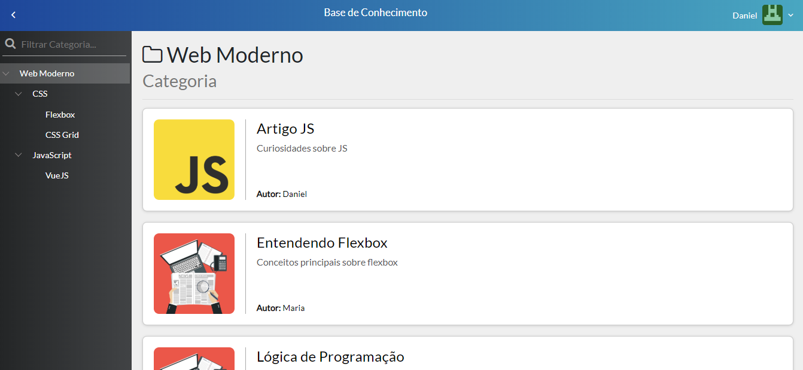

# Knowledge - Front End

Article registration system. Articles are created by users with administrator permission. They can also register, delete and edit articles, categories and users.<br>



## Technologies

- Vue
- Vuex
- Bootstrap
- Axios

## Getting Started

Make sure you are running [Knowledge - Back End](https://github.com/afmdaniel/knowledge-backend) at http://localhost:3000

## Install dependecies
```
npm install
```

### Compiles and hot-reloads for development
```
npm run serve
```

### Compiles and minifies for production
```
npm run build
```

### Lints and fixes files
```
npm run lint
```
